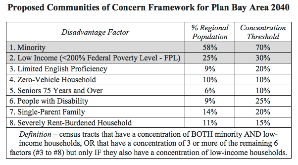

## Communities of Concern 

Identify census tracts within the Bay Area that are considered Communities of Concern as defined by [MTC Resolution No. 4217-Equity Framework for Plan Bay Area 2040](https://mtc.legistar.com/LegislationDetail.aspx?ID=2555452&GUID=575A6D3F-B8B8-44CF-9F2D-ABEF8B3C9F06&Options=ID|Text|&Search=%22communities+of+concern%22)

### Project Management 

**2018 Update**
- [Asana Project](https://app.asana.com/0/229355710745434/526057462891473)
- [Box Directory](https://mtcdrive.box.com/s/nszb0i88eheraaa0303nithjl7ej496y)

## Data Sources

**2018 Update**
- [U.S. Census - American Community Survey 2012-2016](https://www.census.gov/programs-surveys/acs/)
- [U.S. Census - TIGER/Line Shapefiles 2016](https://www.census.gov/geo/maps-data/data/tiger-line.html)

## Analysis Parameters

**2018 Update**
The 2018 update of MTC's Communities of Concern follows the Adopted Communities of Concern (COC) Framework for Plan Bay Area 2040, and is based on on 2012-2016 American Community Survey (ACS) 5-year data. The MTC COC Framework is provided below as well as a table which provides the 8 COC Disadvantage Factors, and relevant ACS table variables. 

  
  

## Methodology

## Expected Outcomes

- Feature class that contains Census Tracts meeting MTC Communities of Concern criteria 
- Web layer that contains Census Tracts meeting MTC Communities of Concern criteria 
- Print map of MTC Communities of Concern

## Results

